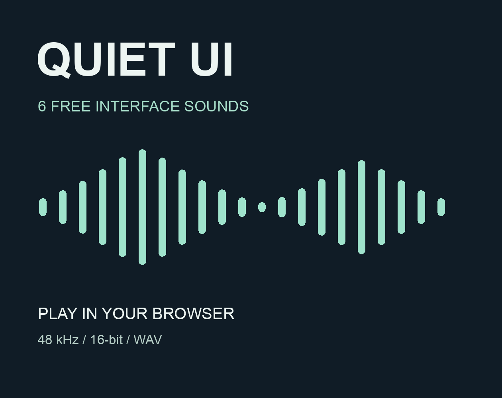

# Quiet UI — six free interface sounds

A small, playable palette of short tonal UI cues for games and apps.

[Play the browser demo](https://bitpotential.itch.io/quiet-ui-free-sampler) · [Full 24-sound collection — US$3](https://bitpotential.itch.io/quiet-ui)

## Included

Hover, select, panel open, confirm, denied and complete. Each file is mono PCM WAV, 48 kHz / 16-bit. These are short one-shot tonal cues, not music loops or recorded mechanical clicks.

Download this folder and open `index.html` locally to audition the files, or import individual WAV files into your project. All audio references are relative; the player has no network dependencies. The purchase link opens the separate store page.

## Usage

Use and modification in commercial and non-commercial finished games, apps and audiovisual projects are permitted; attribution is not required. Standalone resale or redistribution as a sound library is excluded. See [LICENSE.txt](LICENSE.txt) for the full terms. This is a royalty-free asset sampler, not an OSI-licensed software project.

## Production and verification

Procedurally synthesized with oscillator and envelope code, with AI assistance for code and documentation. No third-party recordings or sample libraries were used. WAV structure, decoding and archive integrity have been checked. The hosted sampler was tested from a logged-out browser, including an actual download matched by SHA-256. Independent auditory review and engine-specific validation have not been performed.

The paid collection is separate and is not included here. No account or email is needed for the free hosted demo.
